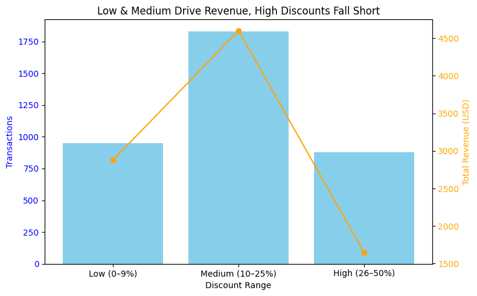
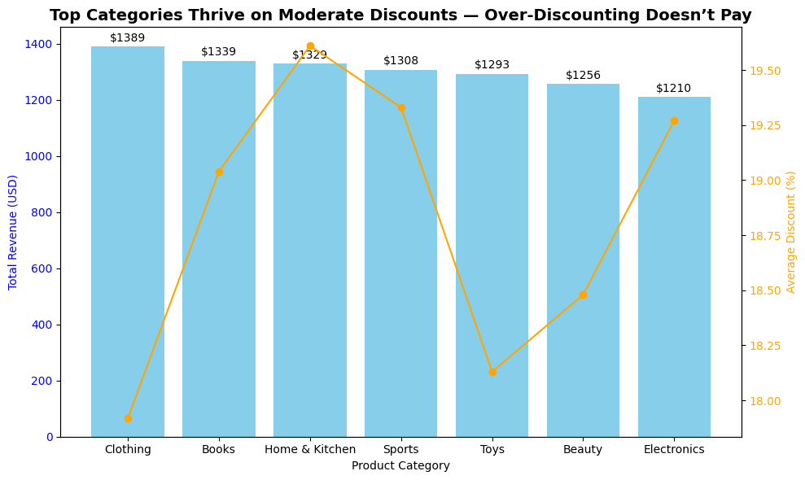
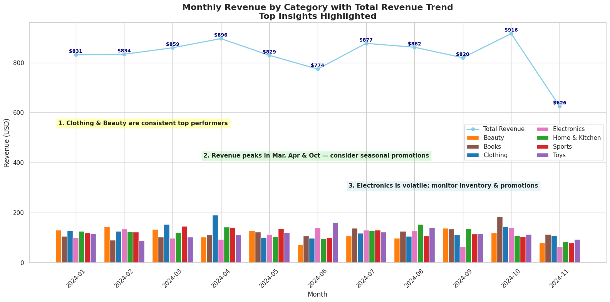
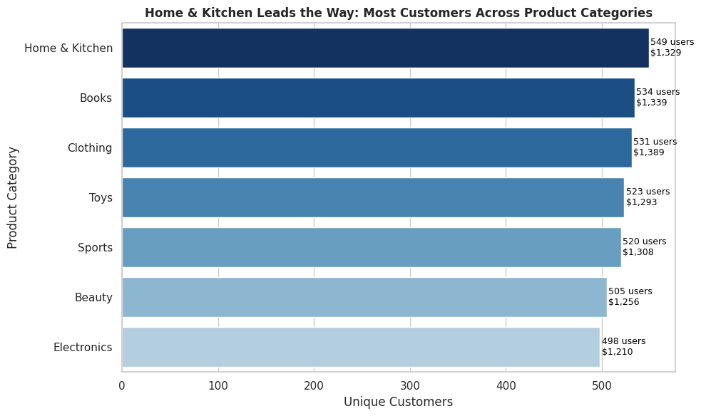

# E-Commerce Sales Analysis

## Table of Contents
1. [Project Overview](#project-overview)
2. [Business Questions](#business-questions)
3. [Analysis Approach](#analysis-approach)
   - [Revenue After Discount](#1-revenue-after-discount)
   - [Discount Impact on Sales](#2-discount-impact-on-sales)
   - [Seasonality](#3-seasonality)
   - [Popular Product Categories](#4-popular-product-categories)
4. [Key Findings & Insights](#key-findings--insights)
5. [Strategic Recommendations](#strategic-recommendations)
6. [Next Steps](#next-steps)
7. [Technical Details](#technical-details)
8. [Author & Contact](#author--contact)

---

## Project Overview

This project analyzes a fictional e-commerce dataset to identify **key drivers of sales, customer behavior, and retention**. Using SQL for data exploration and Python/Tableau for visualizations, the analysis provides actionable insights to **optimize revenue, improve marketing strategy, and enhance customer engagement**.

**Dataset includes:**  
- User ID, Product ID, Category  
- Price (Rs.), Discount (%), Final Price (USD after conversion)  
- Payment Method, Purchase Date  

---

## Business Questions

1. **Which product categories generate the most revenue after discounts?**  
   *Helps identify profitable categories for inventory and marketing focus.*

2. **How do discounts impact sales volume and revenue?**  
   *Shows which discount levels drive revenue effectively without eroding margins.*

3. **Which months show the highest sales, and what categories dominate those months?**  
   *Identifies seasonality and informs marketing campaigns and inventory planning.*

4. **Which product categories attract the most unique customers?**  
   *Highlights broad customer appeal and engagement to guide promotions.*

---

## Analysis Approach

### 1. Revenue After Discount
- Measured total revenue and average discount by category.  
- Identified which categories generate the most value post-discount.

**SQL Query:** [1_value_after_discount.sql](Scripts/1_value_after_discount.sql)  

**Visualization:**  
  

**Key Insights:**  
- Moderate discounts (15–25%) drive the highest transaction volume.  
- Very high discounts (>40%) show diminishing revenue returns.

---

### 2. Discount Impact on Sales
- Grouped transactions into discount ranges to evaluate impact on revenue and volume.  
- Identified optimal discount levels that drive sales without reducing profitability.

**SQL Query:** [2_discount_sales_impact.sql](Scripts/2_discount_sales_impact.sql)  

**Visualization:**  
  

**Key Insights:**  
- Clothing leads in revenue, while Home & Kitchen attracts the most unique customers.  
- Discounts contribute to revenue but must be optimized to prevent margin erosion.
---

### 3. Seasonality
- Analyzed monthly sales and category performance to identify trends.  
- Revealed peak months and categories that dominate during those periods.

**SQL Query:** [3_seasonality.sql](Scripts/3_seasonality.sql)  

**Visualization:**  
  

**Key Insights:**  
- Sales peak in August and November, driven by Electronics and Books.  
- Planning promotions around peak months can maximize revenue.

---

### 4. Popular Product Categories
- Measured unique customer engagement and revenue by category.  
- Identified which categories attract broad customer interest.

**SQL Query:** [4_popular_product_category.sql](Scripts/4_popular_product_category.sql)  

**Visualization:**  
  

**Key Insights:**  
- Home & Kitchen has the most unique customers, suggesting high engagement.  
- Marketing strategies targeting popular categories can reach wider audiences.

---

## Key Findings & Insights

| Metric / Focus                        | Key Insight |
|--------------------------------------|-------------|
| Revenue by Category                   | Clothing leads in revenue; Home & Kitchen engages the most unique customers. |
| Discount Impact                        | Moderate discounts (15–25%) maximize sales volume; higher discounts reduce margins. |
| Payment Methods                        | Credit Card and UPI drive most transactions; Net Banking delivers higher revenue per order. |
| Seasonal Trends                        | August and November are peak months, driven by Electronics and Books. |
| Customer Reach                          | Home & Kitchen attracts the broadest audience, ideal for targeted promotions. |

---

## Strategic Recommendations

1. **Customer Value Optimization**  
   - Focus promotions on high-performing categories (Clothing, Home & Kitchen).  
   - Use personalized campaigns to upsell mid-value customers.  

2. **Discount Strategy**  
   - Offer moderate discounts (15–25%) to drive volume while protecting margins.  
   - Reassess high discounts (>40%) to avoid diminishing returns.  

3. **Seasonality Planning**  
   - Prepare marketing campaigns for August and November peaks.  
   - Align inventory and staffing with seasonal demand spikes.  

4. **Customer Engagement**  
   - Target popular categories (Home & Kitchen) for broad engagement campaigns.  
   - Consider loyalty programs or bundling strategies for highly engaged categories.
---
## Next Steps
- Build **interactive dashboards** (Plotly, Streamlit) for stakeholders.  
- Analyze **SKU-level trends** to identify top-performing products.  
- Monitor **post-discount ROI** to refine pricing and promotion strategy. 
---

## Technical Details
- **Database:** PostgreSQL  
- **Data Analysis:** SQL, Python (Pandas, Matplotlib, Seaborn)  
- **Visualization:** Python, Tableau  
- **Currency Conversion:** Rs. → USD for global audience  

---
### Author & Contact
**Dmitry Kuvyrdin**  
📧 [dmitry.kuvy@gmail.com](dmitry.kuvy@gmail.com)  
💼 [LinkedIn Profile](https://www.linkedin.com/in/dmitry-kuvyrdin/) 

